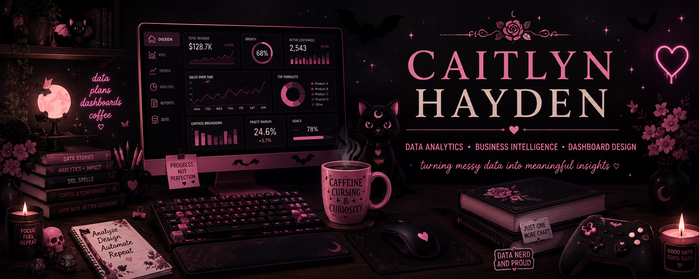

# Hi, I'm Caitlyn!

### Data Analytics • Business Intelligence • Dashboard Design • Professional Problem Solver

[View My Analytics Resume](C%20Hayden%20DA%20Resume) • [LinkedIn](https://www.linkedin.com/in/caitlynhayden)

Welcome to my GitHub!

I'm currently working toward my **B.S. in Data Analytics at Western Governors University** after spending 10+ years working in financial services.

I found my way into analytics because I've always been the person asking, **"Okay...but is there a better way to do this?"**

Whether it was fixing a messy spreadsheet, building a tracker because the existing process wasn't working, creating training resources, or figuring out how to turn a very manual process into something easier to manage, that has always been the kind of work I enjoy most.

Now I'm taking that experience and adding the technical side — **Power BI, Power Query, DAX, SQL, Python, data modeling, and visualization.**

I like building things that are useful, easy to understand, and, because I am who I am, **pretty.**

---

# My Analytics Toolbox

**Tools:**
`Excel` • `Power Query` • `Power BI` • `DAX` • `SQL` • `Python`

**Analytics & Reporting:**
`Data Cleaning` • `Data Modeling` • `Data Visualization` • `KPI Reporting` • `Dashboard Development` • `Data Storytelling`

**Business & Process:**
`Process Improvement` • `Workflow Optimization` • `Root Cause Analysis` • `Requirements Analysis` • `SOP Development` • `Business Process Documentation`

**Currently growing:**
`SQL` • `Python` • `Advanced Power BI` • `DAX` • `Data Modeling`

---

# Featured Projects

## ☕ Caitlyn's Coffee Warehouse | Power BI

This is my biggest analytics project so far and the one where I really started putting all the pieces together.

I created a fictional coffee warehouse business and built the project from the raw data up. That meant cleaning some intentionally messy data, figuring out how everything should connect, building the data model, writing measures, and then turning it all into something that could actually answer business questions.

### What I worked with:

* Power Query for cleaning and transformation
* Relational data modeling
* DAX measures and KPIs
* Revenue, cost, profit, invoice, customer, and product analysis
* Interactive Power BI dashboards
* Filtering, relationships, and refresh testing
* Turning the finished data into actual business takeaways

Basically:

`Messy Data → Clean Data → Model → Measures → Dashboard → "Okay, so what does this actually tell us?"`

That last part is probably my favorite.

---

## 📈 Training Workflow & KPI Dashboard | Excel

This project is probably the closest to the kind of work that originally pushed me toward analytics.

While working in employee training, I saw how difficult it could be to keep track of progress, system access, documentation, follow-ups, and readiness when information lived in different places.

So naturally, I built a spreadsheet.

The original idea came from resources I created professionally, but I rebuilt the portfolio version from scratch using **sample data and generalized workflows** so no company or employee information is included.

The workbook tracks:

* Training KPIs
* Tasks and priorities
* System access
* Onboarding progress
* Overdue items
* Notes and alerts
* Employee readiness
* Cross-sheet reporting

It's a good example of how I naturally approach problems:

**Something isn't working → figure out why → figure out what information is missing → build something better.**

---

## ✈️ Interactive Travel Planning Dashboard | Excel

This project was basically my excuse to see how far I could push Excel without making it *look* like Excel.

I built a multi-sheet travel planner with a dynamic countdown, budget and savings tracking, packing progress, reservations, itinerary planning, checklists, and automated dashboard cards.

This one is much more design-heavy than my other projects, and that was intentional. I wanted to practice building something that wasn't just functional — it also needed to be easy and enjoyable to actually use.

And yes, there is a lot of pink.

---

## 💰 Budget & Financial Planning Tool | Excel

This is where the dashboard obsession really started.

My budget workbook was one of the first big Excel projects I built and one of the projects that made me realize how much I actually enjoy creating tools like this.

It includes monthly budgeting, annual reporting, income and expense tracking, debt management, sinking funds, irregular expense planning, and financial progress tracking.

I'm currently giving it a portfolio refresh, but I'm intentionally not rebuilding the whole thing.

My newer projects are definitely more advanced, but I like being able to look back at this one and see where I started.

---

# Currently Building

## 🖥️ Personal Command Center

Apparently building individual dashboards wasn't enough, so now I'm trying to connect everything.

My next project is a **Personal Command Center** that will bring several different areas of data into one reporting environment, including:

* Finances and budgeting
* School and degree progress
* Career and job-search tracking
* Personal goals
* KPIs and trends
* Automated data transformation
* Multiple connected data sources
* Interactive Power BI reporting

This project is still in the planning/building stage, and I'm using it as a way to push myself further with **Power Query, Power BI, data modeling, automation, SQL, and eventually Python.**

More to come as I build it!

---

# A Little About Me

I'm currently balancing school, work, portfolio projects, and the process of making the jump into my first official analyst role.

I have 10+ years of experience in financial services and operations, so I'm especially interested in analytics that solves real business problems — reporting, process improvement, business intelligence, operational analytics, and figuring out why something isn't working the way it should.

I'm still learning. I'm still building. I definitely still Google things.

But that's also one of the things I like most about analytics. There is always something else to figure out.

And if I can make the final dashboard prettier while I'm at it, even better.

---

# Let's Connect

I'm currently working toward opportunities in **Data Analytics, Business Intelligence, Business Analysis, and Reporting Analytics**.

If you're working in analytics, learning analytics, also making a career change, or just want to talk about one of my projects, feel free to connect with me on [LinkedIn](https://www.linkedin.com/in/caitlynhayden).

Thanks for checking out what I'm building!

**— Caitlyn**

